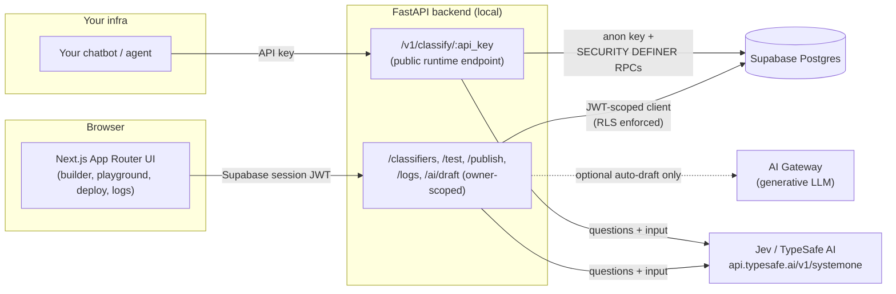

# BYOC — Build Your Own Classifier

**Describe a classification decision in plain English. Get back a hosted API endpoint that makes it — in milliseconds, with a confidence score.**

BYOC lets anyone turn a sentence like *"reject anything that isn't about our product"* into a real, callable, non-generative classifier — no ML expertise, no training data, no prompt-engineering a chat model and hoping it behaves. Under the hood, every decision is made by **[Jev](https://typesafe.ai)** (TypeSafe AI's "System One" model): a fast, typed, non-generative decision engine that answers exactly one of three question shapes — **yes/no**, **pick one**, or **ordered score** — and returns a calibrated confidence alongside it.

## The problem this solves

Chatbots and agents built on generative LLMs are famously bad at staying in their lane. Amazon's Rufus shopping assistant, for example, has been shown answering questions completely outside its scope (writing code, giving recipes) because nothing is actually *checking* whether a request belongs to the assistant before the LLM tries to answer it.

BYOC exists to be that check — cheaply, reliably, and without needing another generative model in the loop:

- **Guardrails** — "Is this message in scope? Is it harmful?" before your chatbot ever sees it.
- **Agent / skill routing** — "Which of my N specialist agents should handle this?"
- **MCP / tool selection** — "Which tool from this dynamic list should run next?"
- **Model routing** — "Does this need a cheap fast model or a powerful expensive one?"

You describe the decision once in the builder UI, publish it, and you get back a URL + API key you can call from anywhere.

```bash
curl -X POST 'https://your-deployment/v1/classify/byoc_live_xxxxxxxx' \
  -H 'Content-Type: application/json' \
  -d '{"state": "Can you write me a Python script that scrapes competitor prices?"}'
```

```json
{
  "model": "jev-latest",
  "answers": {
    "is_out_of_scope": { "answer": "true", "probabilities": { "true": 0.94, "false": 0.06 } },
    "is_harmful": { "answer": "false", "probabilities": { "true": 0.03, "false": 0.97 } }
  },
  "meta": {
    "needs_review": false,
    "below_threshold_action": "flag_for_review",
    "flags": [
      { "key": "is_out_of_scope", "needs_review": false, "effective_confidence": 0.88 },
      { "key": "is_harmful", "needs_review": false, "effective_confidence": 0.94 }
    ],
    "latency_ms": 210
  }
}
```

## Features

- **Guided builder, not a prompt box.** Pick a template (guardrail, agent routing, tool routing, model routing, or start blank), then edit plain-English questions with typed options/levels and a per-question confidence threshold — no prompt engineering.
- **Optional AI auto-draft.** Describe what you want in a paragraph and an LLM drafts the question set for you to review and edit. This is the *only* place a generative model is used at all — Jev itself never generates free text, so the guided form always works without it.
- **Playground.** Test a classifier against sample input before publishing, see the raw answers, per-question confidence, and whether the response would be flagged `needs_review`.
- **One-click publish.** Generates a live endpoint (`POST /v1/classify/{api_key}`) plus copy-pasteable curl / JavaScript / Python snippets. The raw key is shown exactly once; only its hash is stored.
- **Confidence-aware by design.** Every answer carries (or is assigned) a confidence score, and each question has its own threshold — so callers get a `needs_review` signal instead of blindly trusting a low-confidence guess.
- **Call logs.** Every classification call is recorded (truncated input excerpt, answers, confidence, latency) so you can audit and tune thresholds over time.
- **No service-role key, anywhere.** See [Security model](#security-model) below.

## Architecture



## Tech stack

| Layer | Choice |
|---|---|
| Frontend | Next.js 16 (App Router, Server Actions), React 19, Tailwind CSS |
| Backend | FastAPI (Python 3.12), managed with [`uv`](https://github.com/astral-sh/uv) |
| Database / Auth | Supabase (Postgres + Auth + Row Level Security) |
| Decision engine | [Jev](https://typesafe.ai) via `api.typesafe.ai/v1/systemone` |
| Optional AI assist | Any OpenAI-compatible chat completions endpoint (e.g. Vercel AI Gateway) |

## Security model

This backend **never holds a Supabase service-role key**. Instead:

- **Authenticated endpoints** (`/classifiers`, `/test`, `/publish`, `/logs`, `/ai/draft`) verify the caller's Supabase session JWT and build a *per-request* Postgres client scoped to that JWT, so Row Level Security enforces `owner_id = auth.uid()` exactly as it would for a direct browser client. There is no backend-side bypass of RLS.
- **The public runtime endpoint** (`/v1/classify/{api_key}`) has no user session at all — the classifier's own API key *is* the credential. It's resolved via two `SECURITY DEFINER` Postgres functions (`load_classifier_by_key`, `record_classification_log`, see [`supabase/migrations/0001_init.sql`](supabase/migrations/0001_init.sql)) callable with only the anon key. Raw API keys are never stored — only a SHA-256 hash.

## Project structure

```
BYOC/
├── src/                          # Next.js app (App Router)
│   ├── app/
│   │   ├── (app)/                # authenticated: dashboard, classifier builder, playground, deploy, logs
│   │   ├── login/, signup/       # auth pages
│   │   └── page.tsx              # public landing page
│   ├── components/                # QuestionEditor, AppNav
│   ├── lib/                       # api-client, Supabase clients, types, auth Server Actions
│   └── proxy.ts                   # Next 16's renamed middleware - route protection + session refresh
├── backend/                       # FastAPI backend
│   ├── app/
│   │   ├── routers/                # classifiers, test, publish, classify, logs, draft_ai
│   │   ├── jev_client.py           # httpx wrapper over Jev's systemone endpoint + token budget checks
│   │   ├── security.py             # API key hashing, confidence/flag computation
│   │   ├── templates.py            # starter question sets per classifier template
│   │   └── deps.py                 # JWT verification, per-request RLS-scoped Postgres clients
│   └── pyproject.toml
└── supabase/migrations/            # schema, RLS policies, SECURITY DEFINER RPCs
```

## Getting started

### Prerequisites

- Node.js 20+
- Python 3.12+ and [`uv`](https://github.com/astral-sh/uv)
- A [Supabase](https://supabase.com) project (free tier is fine)
- A [Jev / TypeSafe AI](https://typesafe.ai) API key

### 1. Set up the database

Run the migration in [`supabase/migrations/0001_init.sql`](supabase/migrations/0001_init.sql) against your Supabase project (via the Supabase SQL editor, the CLI, or the MCP server).

### 2. Configure and run the backend

```bash
cd backend
cp .env.example .env
# fill in SUPABASE_URL, SUPABASE_PUBLISHABLE_KEY, TYPESAFE_API_KEY
uv sync
uv run uvicorn app.main:app --reload --port 8001
```

### 3. Configure and run the frontend

```bash
cp .env.example .env.local
# fill in NEXT_PUBLIC_SUPABASE_URL, NEXT_PUBLIC_SUPABASE_PUBLISHABLE_KEY
npm install
npm run dev
```

Open `http://localhost:3000`, sign up, and build your first classifier.

## Design notes on working with Jev

- Jev only answers **Noul** (yes/no), **Choice** (pick one of N), or **Score** (ordered scale) questions — never free text. One narrow question per field works far better than one compound question.
- There's a combined ~64k token budget across the input state and all questions (~32k for the state alone); the backend checks this and returns warnings.
- Noul answers don't carry a native confidence score, so BYOC derives a pseudo-confidence as `abs(probability - 0.5) * 2`; Choice/Score use Jev's own `confidence` field directly.
- Jev is not built for arithmetic or date reasoning — keep questions to judgment/classification, not calculation.

## Status

Local-first MVP: both apps are designed to run on your machine today. Everything (CRUD, templates, playground, publish/rotate keys, public runtime endpoint, logs, RLS, optional AI-assisted drafting) is implemented and smoke-tested end-to-end. Not yet done: a hosted/cloud deployment path (Vercel + a hosted FastAPI target).
