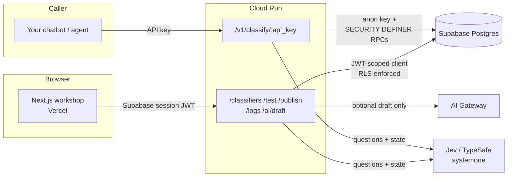

# BYOC — Build Your Own Classifier

**Describe a classification decision in plain English. Get a hosted API that makes it — typed, fast, with a confidence score.**

[Live app](https://byoc-web.vercel.app) · [API](https://byoc-api-478981500431.us-central1.run.app/docs) · [GitHub](https://github.com/shashnkvats/BYOC)

BYOC turns a sentence like *“reject anything that isn’t about our product”* into a callable, **non-generative** classifier. No training data. No hoping a chat model stays in its lane. Every decision is made by **[Jev](https://typesafe.ai)** (TypeSafe AI’s System One): a typed decision engine that answers exactly one of three shapes — **yes/no**, **pick one**, or **ordered score** — and returns confidence next to the answer.

The workshop UI is on Vercel. The FastAPI runtime is on Cloud Run. Auth and data sit on Supabase with row-level security.

---

## Why this exists

Generative assistants are bad at staying in scope. A shopping bot will write Python if you ask, because nothing *checks* whether the request belongs to the product before the LLM starts talking.

BYOC is that check. Cheap, auditable, and not another generative hop:

| Starting point | Example decision |
|---|---|
| **Guardrail** | Is this message in scope? Is it harmful? |
| **Agent / skill routing** | Which specialist agent should handle this? |
| **MCP / tool selection** | Which tool from this list should run next? |
| **Model routing** | Cheap-fast model, or the expensive one? |

You walk a three-step wizard (template → name → questions), publish once, and get a URL plus an API key you can call from a bot, an agent, or a curl script.

```bash
curl -X POST 'https://byoc-api-478981500431.us-central1.run.app/v1/classify/byoc_live_xxxxxxxx' \
  -H 'Content-Type: application/json' \
  -d '{"state": "Can you write me a Python script that scrapes competitor prices?"}'
```

```json
{
  "model": "jev-latest",
  "answers": {
    "is_out_of_scope": { "answer": "true", "probabilities": { "true": 0.94, "false": 0.06 } },
    "is_harmful": { "answer": "false", "probabilities": { "true": 0.03, "false": 0.97 } }
  },
  "meta": {
    "needs_review": false,
    "below_threshold_action": "flag_for_review",
    "flags": [
      { "key": "is_out_of_scope", "needs_review": false, "effective_confidence": 0.88 },
      { "key": "is_harmful", "needs_review": false, "effective_confidence": 0.94 }
    ],
    "latency_ms": 210
  }
}
```

Replace `byoc_live_xxxxxxxx` with a key from **Deploy** after you publish a classifier.

---

## What you can do in the app

- **Workshop, not a dashboard.** Your classifiers as an editorial list — name, type, last edited, live/draft — not analytics chrome.
- **Three-step create.** Cards for the four starting points, then a name, then seeded questions. Create lands you back in the workshop.
- **Question editor.** Numbered Noul / Choice / Score fields with plain-English instructions, typed criteria, and a per-question confidence threshold.
- **Playground.** Run sample state before you publish. See answers, effective confidence, and `needs_review`.
- **One-click publish.** Issues `POST /v1/classify/{api_key}` plus curl / JavaScript / Python snippets. The raw key is shown once; only a SHA-256 hash is stored.
- **Call logs.** Truncated input, answers, confidence, latency — enough to tune thresholds.
- **Optional AI auto-draft.** A paragraph can draft the question set for you to edit. That is the **only** generative call in the product. Leave `AI_GATEWAY_API_KEY` empty and the guided form still works.

---

## Architecture



| Layer | What’s running |
|---|---|
| Frontend | Next.js 16 App Router, React 19, Tailwind v4 — [byoc-web.vercel.app](https://byoc-web.vercel.app) |
| Backend | FastAPI (Python 3.12, `uv`) — [Cloud Run](https://byoc-api-478981500431.us-central1.run.app/docs) |
| Database / Auth | Supabase Postgres + Auth + RLS. **No service-role key anywhere.** |
| Decision engine | [Jev](https://typesafe.ai) via `api.typesafe.ai/v1/systemone` |
| Optional draft | OpenAI-compatible chat completions (e.g. Vercel AI Gateway) |

---

## Security model

The API **never holds a Supabase service-role key**.

- **Owner routes** (`/classifiers`, `/test`, `/publish`, `/logs`, `/ai/draft`) verify the Supabase session JWT and open a *per-request* Postgres client scoped to that JWT. RLS enforces `owner_id = auth.uid()` the same way a browser client would. There is no backend bypass.
- **Public runtime** (`/v1/classify/{api_key}`) has no user session. The classifier’s API key *is* the credential. It is resolved through `SECURITY DEFINER` functions (`load_classifier_by_key`, `record_classification_log` in [`supabase/migrations/0001_init.sql`](supabase/migrations/0001_init.sql)) using only the publishable/anon key.
- Raw keys are never stored — SHA-256 only.

---

## Repository

```
BYOC/
├── src/                         # Next.js App Router
│   ├── app/
│   │   ├── (app)/               # workshop, create wizard, editor, playground, deploy, logs
│   │   ├── login/ signup/
│   │   └── page.tsx             # public landing
│   ├── components/
│   ├── lib/                     # api-client, Supabase, templates, types
│   └── proxy.ts                 # Next 16 session + route protection
├── backend/
│   ├── Dockerfile               # Cloud Run image
│   ├── app/
│   │   ├── routers/             # classifiers, test, publish, classify, logs, draft_ai
│   │   ├── jev_client.py
│   │   ├── security.py          # key hashing, confidence, needs_review
│   │   ├── templates.py
│   │   └── deps.py              # JWT + RLS-scoped Postgres
│   └── pyproject.toml
└── supabase/migrations/         # schema, RLS, SECURITY DEFINER RPCs
```

---

## Run it locally

You need Node 20+, Python 3.12, [`uv`](https://github.com/astral-sh/uv), a Supabase project, and a [TypeSafe / Jev](https://typesafe.ai) API key.

**1. Database.** Run [`supabase/migrations/0001_init.sql`](supabase/migrations/0001_init.sql) on the project (SQL editor or CLI).

**2. Backend**

```bash
cd backend
cp .env.example .env
# SUPABASE_URL, SUPABASE_PUBLISHABLE_KEY, TYPESAFE_API_KEY
uv sync
uv run uvicorn app.main:app --reload --host 127.0.0.1 --port 8001
```

Docs: [http://127.0.0.1:8001/docs](http://127.0.0.1:8001/docs)

**3. Frontend**

```bash
cp .env.example .env.local
# NEXT_PUBLIC_SUPABASE_URL, NEXT_PUBLIC_SUPABASE_PUBLISHABLE_KEY
# NEXT_PUBLIC_API_URL=http://127.0.0.1:8001
npm install
npm run dev -- --hostname 127.0.0.1 --port 3001
```

Open [http://127.0.0.1:3001](http://127.0.0.1:3001), sign up, create a classifier.

If you bind the API to `127.0.0.1:8001` and something else is already listening on `*:8001` (Docker IPv6 is a common culprit), the local Next app will miss it. Use the host bind above.

---

## Production

| Piece | Where |
|---|---|
| UI | Vercel project `byoc-web` — `NEXT_PUBLIC_SUPABASE_*` and `NEXT_PUBLIC_API_URL` pointing at Cloud Run |
| API | GCP project `byoc-classifier`, Cloud Run service `byoc-api`, `us-central1` |
| CORS | `FRONTEND_ORIGIN` includes `https://byoc-web.vercel.app` |

The backend image is `backend/Dockerfile`. Redeploy after changing env:

```bash
cd backend
gcloud run deploy byoc-api \
  --project=byoc-classifier \
  --source . \
  --region=us-central1 \
  --allow-unauthenticated
```

`TYPESAFE_API_KEY` must be set on the Cloud Run service for playground and `/v1/classify` to reach Jev. `AI_GATEWAY_API_KEY` is optional.

In Supabase Auth, allow `https://byoc-web.vercel.app` (and `https://byoc-web.vercel.app/**`) as a redirect URL.

---

## Working with Jev

- Only **Noul** (yes/no), **Choice** (one of N), or **Score** (ordered scale). Never free text. One narrow question beats one compound question.
- Combined budget is about 64k tokens for state + questions (~32k for state alone). The backend estimates and warns.
- Noul has no native confidence; BYOC uses `abs(p − 0.5) × 2`. Choice and Score use Jev’s own `confidence`.
- Jev is for judgment, not arithmetic or date math.

---

## Status

Hosted end-to-end: workshop on Vercel, classify API on Cloud Run, data and auth on Supabase. Local `uv` / `next dev` still works for development. Optional LLM auto-draft stays off until `AI_GATEWAY_API_KEY` is set.
